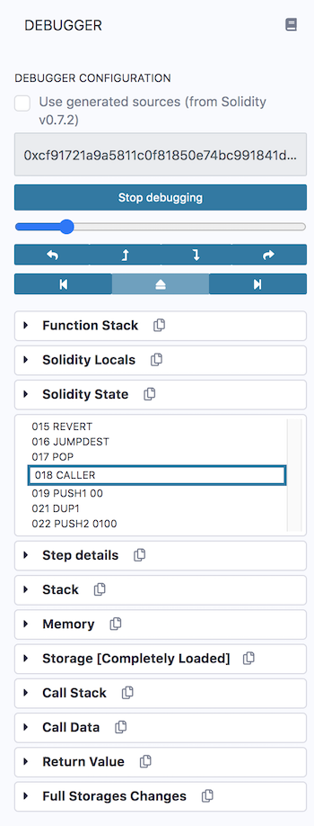
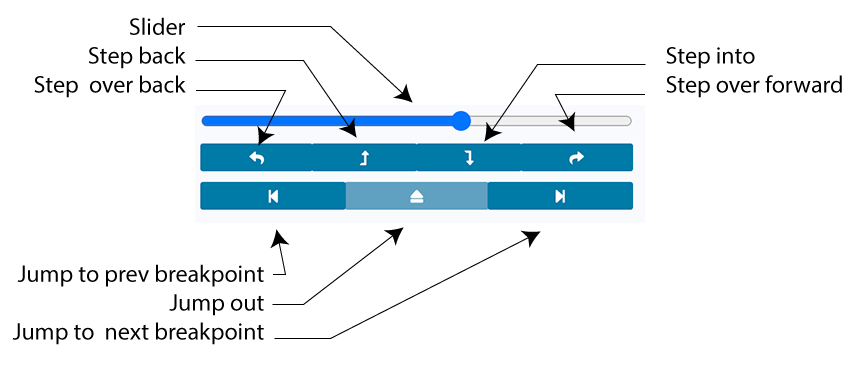
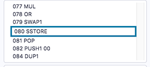
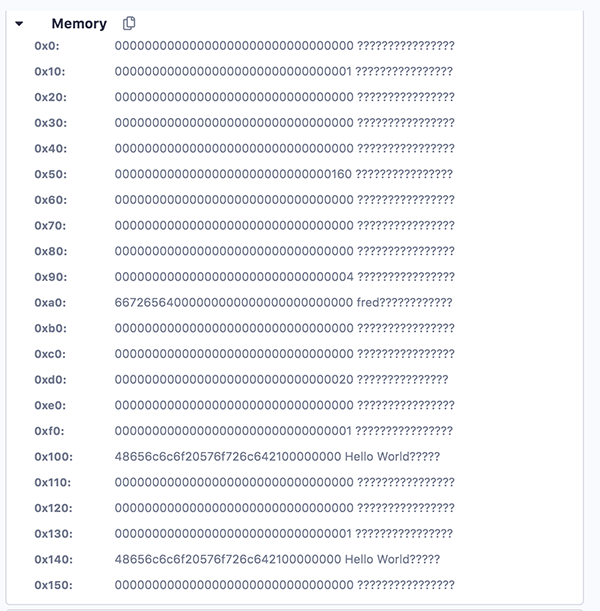

Debugger
========

The Debugger shows the state of a contract while crunching through a transaction.  

It can be used on transactions created on Remix or by providing a transaction's address.  The latter assumes that you have the contract's source code or that you have input the address of a verified contract.

The state of a contract is shown in the Debugger's many panels.


To start a debugging session either:
 * **Click** the debug button in the Terminal when a successful or failed transaction appears there. The Debugger will be activated and will gain the focus in the **Side Panel**.

 * **Activate** the Debugger in the Plugin Manager and then click the bug in the icon panel. To start the debugging session, input the address of a deployed transaction - while having the source code in the editor and then click the **Start debugging** button.

 The debugger will highlight the relevant code in the Editor.  If you want to go back to editing the code without the Debugger's highlights, then click the **Stop Debugging** button.

To learn more about how to use this tool go to the [debugger tutorial](tutorial_debug.html).

## The Debugger's navigation & panels


### Use generated sources
This option is available for contracts using Solidity 0.7.2 or greater. See the solidity blog for more details about [generated sourcess](https://blog.soliditylang.org/2020/09/28/solidity-0.7.2-release-announcement/#notable-new-features).

Using **generated sources** will make it easier to audit your contracts.  When the option is checked, you can step into those compiler outputs — while debugging. 


These compiler outputs will appear in a separate .yul file in the Remix editor.

### Slider & buttons


#### Slider 
The slider allows you to scroll through the transaction.  The highlighting in the associated source code will point out which sections of the code is being operated on.  As the slider is moved the list of opcodes scroll - see the opcode section below.

#### Step over back 
Goes to the previous opcode.  If the previous step involves a **function call**, function will not be entered.
#### Step back
This button steps back to the previous opcode.
#### Step into
This button advances to the next opcode. If the next line contains a function call, **Step into** will go into the function.
#### Step over forward
Advances to the next opcode.  If the next step involves a **function call**, function will not be entered.
#### Jump to the previous breakpoint
Breakpoints can be placed in the gutter of the Editor. If a breakpoint is has been passed in the code, this button will return to that point.

#### Jump out

#### Jump to the next breakpoint
If a breakpoint is ahead in the code, this button will advance to that point.

### Function stack
Lists the functions that the transaction interacted with.
### Solidity Locals
The Solidity Locals are the local variables inside a function.

### Solidity State
These are the state variables of the contract.

### Opcodes
This panel shows the step number and the opcode that the debugger is currently on.



As you drag the slider (the one above the navigation buttons), the focussed step number & opcode changes.
### Step details
Step details shows more info about the opcode step.  
### Stack

This panel shows the EVM Stack.

The stack is a dedicated place in memory that is used by the compiler (in so much as the compiler defines the instructions that use it) to control program execution flow and store local variables etc. ... The stack is still stored in main memory it is just not part of memory that you (the programmer) can directly control.
### Memory

Memory is cleared for each new message call. Memory is linear and can be addressed at byte level. **Reads** are limited to a width of 256 bits while **writes** can be either 8 bits or 256 bits wide. 

The Memory panel consists of 3 columns.  You might need to make Remix's side panel a bit wider to get the formatting to be correct. (Drag the border between the main panel and the side panel to the right).

The 1st column is the location in memory.  The 2nd column is the hex encoded value.  The 3rd column is the decoded value.  If there is nothing, then the question marks (**?**) will show - like this:
```
0x10: 00000000000000000000000000000000 ????????????????
```

Here is a full example of the **Memory** panel,



Some address slots have hex encoded values and those values are then decoded.  For example, check position **0xa0** and **0x140**.
### Storage
This is the persistant storage.
### Call Stack
All computations are performed on a data array called the stack. It has a maximum size of 1024 elements and contains words of 256 bits.
### Call Data
The call data contains the functions parameters. 
### Return Value
The refers to the value that the function will return.
### Full Storage Changes
This shows the persistant storage at the end of the function.

## Breakpoints
Breakpoints can be placed in the gutter of the Editor to pause the debugger.

## Additional Info
The debugger's granular information gives users detailed information about what is going on in a smart contract.  It can also be used as a teaching tool.

To learn more go to [Debugging Transactions](tutorial_debug.html).
