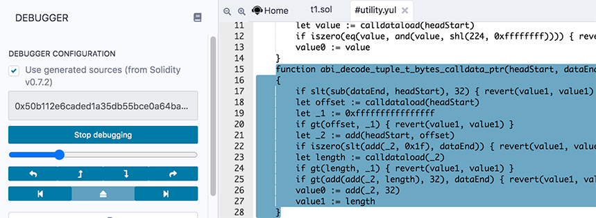

Debugger
========

The Debugger shows the state of a contract while crunching through a transaction.  

It can be used on transactions created on Remix or by providing a transaction's address.  The latter assumes that you have the contract's source code or that you have input the address of a verified contract.

The state of a contract is shown in the Debugger's many panels.


To start a debugging session either:
 * **Click** the debug button in the Terminal when a successful or failed transaction appears there. The Debugger will be activated.

 * **Activate** the Debugger in the Plugin Manager and then click the bug in the icon panel. To start the debugging session, input the address of a deployed transaction - while having the source code in the editor and then click the **Start debugging** button.

 The debugger will hightlight the relevant code in the Editor.  So if you want to go back to editing the code without the highlights that the Debugger has put there, then click the **Stop Debugging** button.

To learn more about how to use this tool go to the [debugger tutorial](tutorial_debug.html).

## The Debugger's sections & panels.


### Use generated sources
This option is available for contracts using Solidity 0.7.2 or greater. See the solidity blog for more details about [generated sourcess](https://blog.soliditylang.org/2020/09/28/solidity-0.7.2-release-announcement/#notable-new-features).

Using **generated sources** will make it easier to audit your contracts.  When the option is checked, you can step into those compiler outputs — while debugging. 



These compiler outputs will appear in a separate .yul file in the Remix editor.

### Navigation slider & buttons
Step over back 
Step back
Step into
Step over forward
Jump to the previous breakpoint
Jump out
Jump to the next breakpoint


### Function stack
Lists the functions that the transaction interacted with.
### Solidity Locals
The Solidity Locals are the local variables inside a function.

### Solidity State
These are the state variables of the contract.

### Opcodes
The high level languages of smart contract compile down to **opcodes**.  As you drag the slider above the navigation buttons, it will be scrolling over the opcode list. 
### Step details
Step details show more info about the opcode step.  
### Stack

### Memory
Memory is cleared for each new message call. Memory is linear and can be addressed at byte level. **Reads** are limited to a width of 256 bits while **writes** can be either 8 bits or 256 bits wide. 

A line like the following in the Memory panel:
```
0x10:
00000000000000000000000000000000 ????????????????
```
This means that the memory address 0x10 there is nothing.  The many question marks mean...

### Storage
This is the persistant storage.
### Call Stack
All computations are performed on a data area called the stack. It has a maximum size of 1024 elements and contains words of 256 bits.
### Call Data

### Return Value
The refers to the value that the function will return.
### Full Storage Changes


The debugger's granular information gives users very detailed information about what is going on in a smart contract.  Thus the Debugger is a good teaching tool.

Learn more about using this tool with the [debugger tutorial](tutorial_debug.html).
