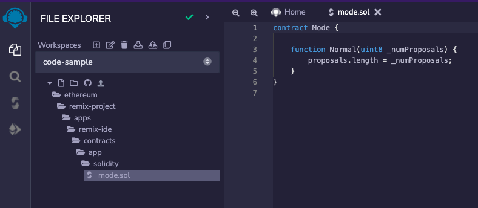

Remix as code viewer
=============================

Through Etherscan
------------------

If there is a contract verified on Etherscan and someone wants to have a look on it in an IDE, mostly for a mutiple part contract verification, Remix provides a quick way to load the contract.

Usually, contract is shown on Etherscan on a URL like this:

`https://etherscan.io/address/0xdac17f958d2ee523a2206206994597c13d831ec7`

In URL, just update `etherscan.io` with `remix.ethereum.org`

`https://remix.ethereum.org/address/0xdac17f958d2ee523a2206206994597c13d831ec7`

and reload. It will fetch the contracts verified on Ethereum mainnnet and on other testnets (Ropsten, Rinkeby, Kovan & Goerli).

This works for Etherscan testnet URLs like `https://ropsten.etherscan.io` etc.

Loaded contracts will be stored under `etherscan-code-sample` workspace. 

Through GitHub
------------------

If a .sol file is opened in Github and someone wants to just compile it or try some changes with it, file can be loaded on Remix similarly. For a file with URL like:

`https://github.com/ethereum/remix-project/blob/master/apps/remix-ide/contracts/app/solidity/mode.sol`

update `github.com` to `remix.ethereum.org` like:

`https://remix.ethereum.org/ethereum/remix-project/blob/master/apps/remix-ide/contracts/app/solidity/mode.sol`

and reload. It will open the same file in Remix IDE.

