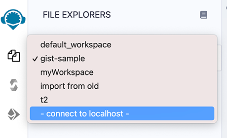
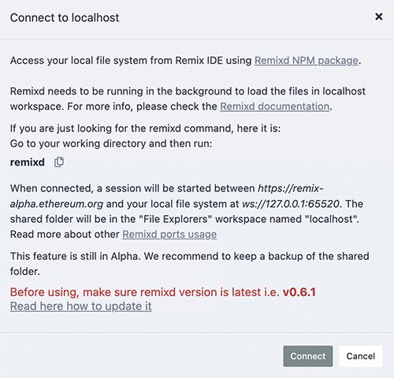
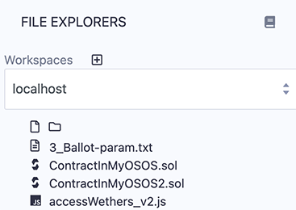

Remixd: Access your Local Filesystem 
=========================================
To give the Remix IDE (the web app) access to a folder on your computer, you need to use **Remixd** - the plugin along with **remixd** - the cli/npm module. 

The **Remixd** plugin can be activated from the plugin manager or in the **File Explorers** - see the image below.  The **connect to local host** - will activate the **Remixd** plugin.



Once you click **connect to local host** or activate Remixd from the **Plugin Manager**, a modal will come up:



The Remixd plugin is a **websocket plugin** and it has no UI other than this modal dialog box - so you won't see a Remixd icon in the icon panel.

Before you hit **Connect**, you need to install the **remixd** NPM module and run the **remixd** command. 

The code of `remixd` is
[here](https://github.com/ethereum/remix-project/tree/master/libs/remixd) .

### remixd Installation
**remixd** can be globally installed using the following command:
`npm install -g @remix-project/remixd`

Or just install it in the directory of your choice by removing the -g flag:
`npm install @remix-project/remixd`

**NOTE:** The npm address as well as the github repo of remixd have changed - in both cases moving under **remix-project**. 
- **Github** address is:
**https://github.com/ethereum/remix-project/tree/master/libs/remixd**
- **NPM** address is: **remix-project/remixd**

### Find your version of remixd
The command: `remixd -v` or `remixd --verison` will return your version number.  

**If this command does not work, then you have an outdated version!**
### Update to the latest remixd
Because **remixd** creates a bridge from the browser to your local filesystem, it is important that you have the latest version of script.  

For users who had installed the version of remixd from the old NPM address or for users who do not know which NPM address they had installed it from, run these 2 steps:

1. uninstall the old one: **npm uninstall -g remixd**
2. install the new: **npm install -g @remix-project/remixd**

For users who know that they have a remixd version installed from @remix-project/remixd then just run: 

**npm install -g @remix-project/remixd**

### remixd Command
From the terminal, the command `remixd -s <absolute-path-to-the-shared-folder> --remix-ide <your-remix-ide-URL-instance>` <br>will start **remixd** and will share the given folder with Remix IDE. 

#### HTTP vs HTTPS in the remixd command
If your browser is on https://remix.ethereum.org (**secure http**) then use https in the command:<br>
`remixd -s <absolute-path-to-the-shared-folder> --remix-ide https://remix.ethereum.org`

Or if you are using **http** in the browser, then use **http** in the remixd command.

#### Read/Write permission & Read-only mode
The folder is shared using **a websocket connection** between `Remix IDE`
and `remixd`.

Be sure the user executing `remixd` has read/write permission on the
folder.

Alternatively, there is an option to run remixd in read-only mode, use `--read-only` flag.

### Warning!
- `remixd` **provides full read and write access** to the given folder **for any
application** that can access the `TCP port 65520` on your local host.

- To minimize the risk, Remixd can **ONLY** bridge between your filesystem and the Remix IDE URLS - including:

```
  https://remix.ethereum.org
  https://remix-alpha.ethereum.org
  https://remix-beta.ethereum.org
  http://remix.ethereum.org
  http://remix-alpha.ethereum.org
  http://remix-beta.ethereum.org
  package://a7df6d3c223593f3550b35e90d7b0b1f.mod
  package://6fd22d6fe5549ad4c4d8fd3ca0b7816b.mod
  https://ipfsgw.komputing.org
```
(the package:// urls in the list above are for remix desktop)

### Clicking Connect on the modal.

Clicking on the **Connect** button on the Remixd modal (see the image above), will attempt to start a session where your browser can access the specified folder on your computer's filesystem.

If you do not have `remixd` running in the background - another modal will open up and it will say: 

```
Cannot connect to the remixd daemon. 
Please make sure you have the remixd running in the background.
```

Assuming you don't get the 2nd modal, your connection to the remixd daemon is successful. The shared folder will be visible in the File Explorer's workspace under **localhost**.



### Creating & deleting folders & files
Clicking on the **new folder** or **new file** icon under **localhost** will create a new file or folder in the shared folder.  Similarly, if you **right click** on a file or folder you can **rename** or **delete** the file.

### Closing a remixd session
In the terminal where **remixd** is running, typing `ctrl-c` will close the session.  Remix IDE will then put up a modal saying that **remixd** has stopped running.