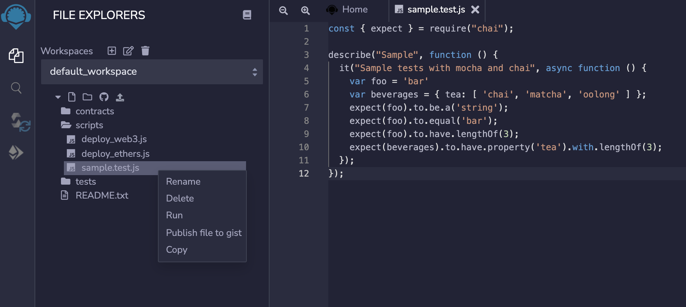
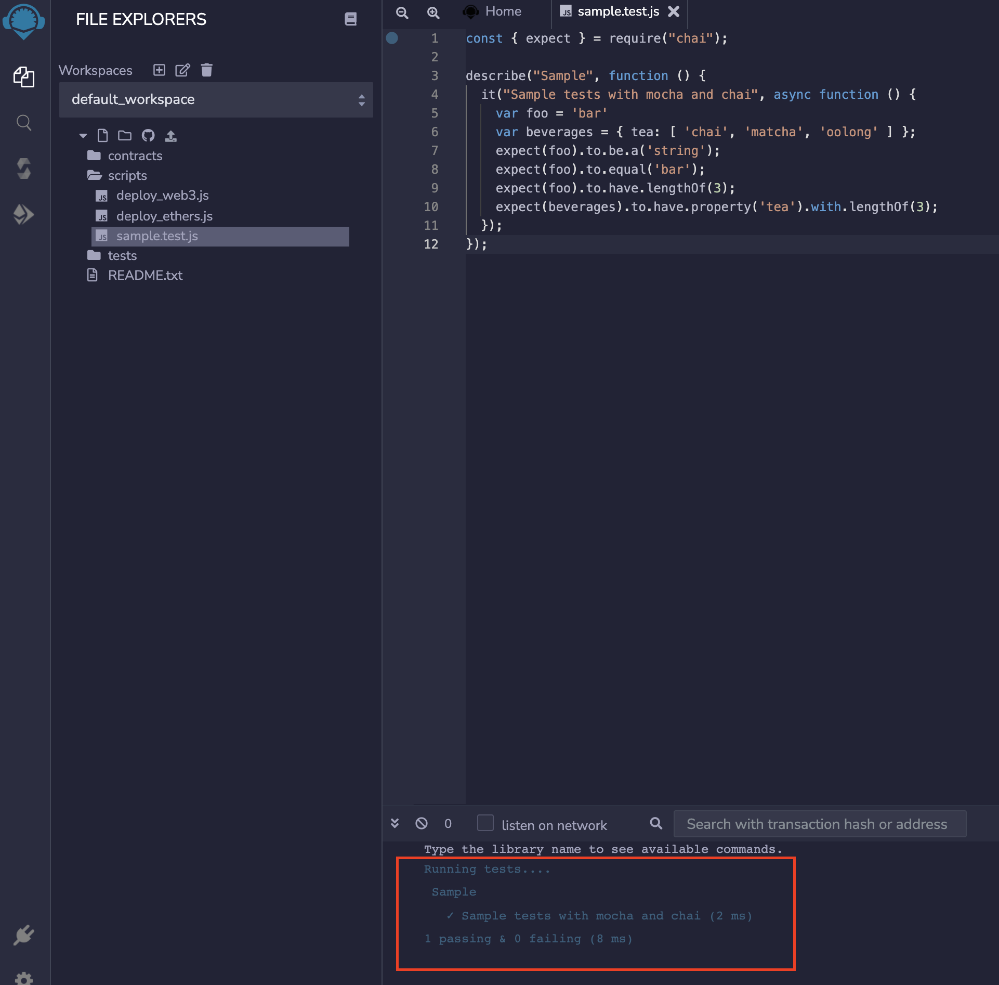
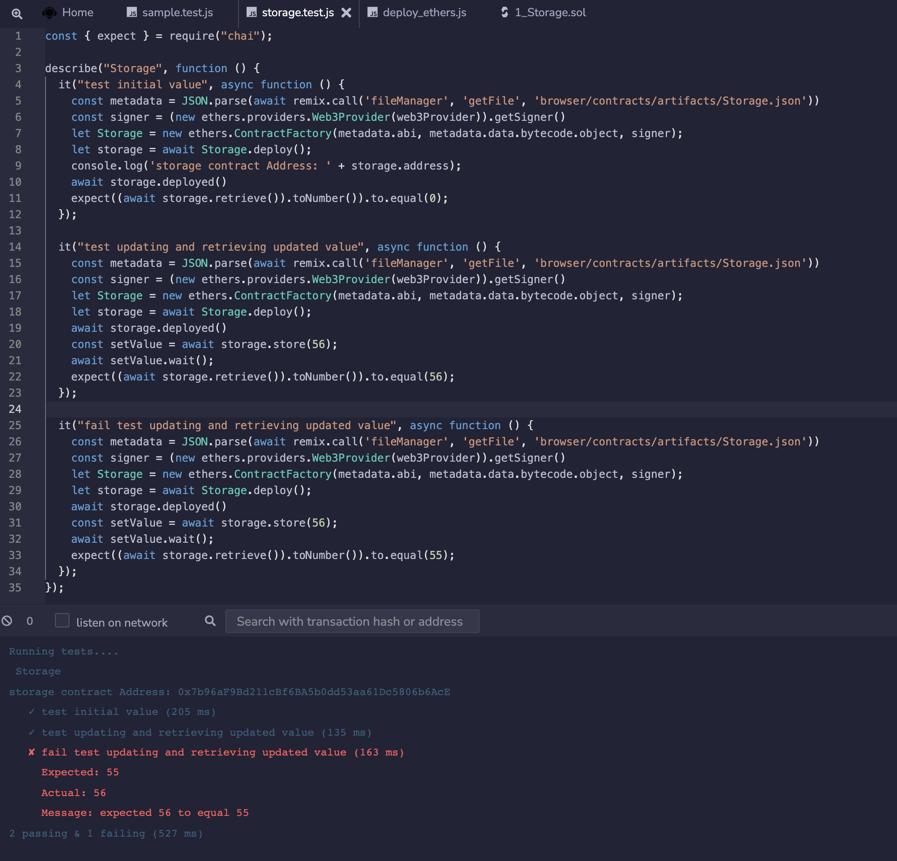
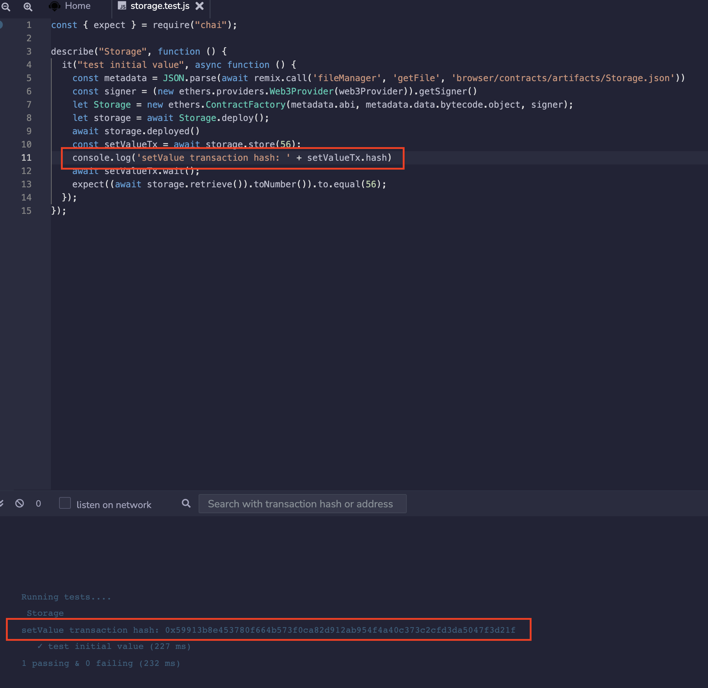
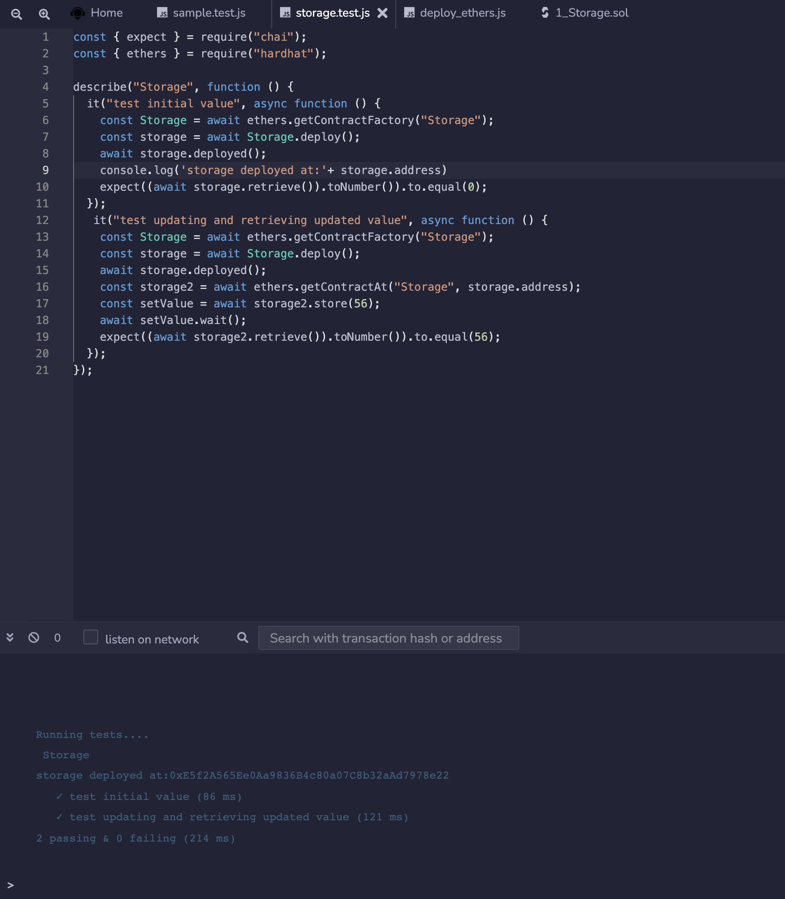

Testing using Chai & Mocha
===================

_(Supported since Remix IDE v0.22.0)_

Remix supports testing of your files in JavaScript using assertion library [Chai](https://www.chaijs.com/) & test framework [Mocha](https://mochajs.org/)

_Chai is a BDD / TDD assertion library for node and the browser that can be delightfully paired with any javascript testing framework._

_Mocha is a feature-rich JavaScript test framework running on Node.js and in the browser, making asynchronous testing simple and fun._

## Write tests

Create a js file in your project workspace. Better to create it inside `scripts` folder. Lets name it `sample.test.js`.

Write your tests in the file. Here is a sample:

```
const { expect } = require("chai");

describe("Sample", function () {
  it("Sample tests with mocha and chai", async function () {
    var foo = 'bar'
    var beverages = { tea: [ 'chai', 'matcha', 'oolong' ] };
    expect(foo).to.be.a('string');
    expect(foo).to.equal('bar');
    expect(foo).to.have.lengthOf(3);
    expect(beverages).to.have.property('tea').with.lengthOf(3);
  });
});
```

## Run tests

Once done with writing the tests, right click on file name in `File Explorers` plugin. It will show some options along with option to `Run with Mocha`.



Click on `Run with Mocha` option, tests will be executed and result will be shown on Terminal.



## Test a contract

Similarly unit tests can be written to test the functionality of a smart contract. An example to test default `1_Storage.sol` contract can be as:

```
const { expect } = require("chai");

describe("Storage", function () {
  it("test initial value", async function () {
    const metadata = JSON.parse(await remix.call('fileManager', 'getFile', 'browser/contracts/artifacts/Storage.json'))
    const signer = (new ethers.providers.Web3Provider(web3Provider)).getSigner()
    let Storage = new ethers.ContractFactory(metadata.abi, metadata.data.bytecode.object, signer);
    let storage = await Storage.deploy();
    console.log('storage contract Address: ' + storage.address);
    await storage.deployed()
    expect((await storage.retrieve()).toNumber()).to.equal(0);
  });

  it("test updating and retrieving updated value", async function () {
    const metadata = JSON.parse(await remix.call('fileManager', 'getFile', 'browser/contracts/artifacts/Storage.json'))
    const signer = (new ethers.providers.Web3Provider(web3Provider)).getSigner()
    let Storage = new ethers.ContractFactory(metadata.abi, metadata.data.bytecode.object, signer);
    let storage = await Storage.deploy();
    await storage.deployed()
    const setValue = await storage.store(56);
    await setValue.wait();
    expect((await storage.retrieve()).toNumber()).to.equal(56);
  });

  it("fail test updating and retrieving updated value", async function () {
    const metadata = JSON.parse(await remix.call('fileManager', 'getFile', 'browser/contracts/artifacts/Storage.json'))
    const signer = (new ethers.providers.Web3Provider(web3Provider)).getSigner()
    let Storage = new ethers.ContractFactory(metadata.abi, metadata.data.bytecode.object, signer);
    let storage = await Storage.deploy();
    await storage.deployed()
    const setValue = await storage.store(56);
    await setValue.wait();
    expect((await storage.retrieve()).toNumber()).to.equal(55);
  });
});
```

Result will be as:



## Debugging a test transaction

To debug a transaction in one of the tests can be done by printing the tranasation hash and using the [Remix Debugger plugin](https://remix-ide.readthedocs.io/en/latest/tutorial_debug.html).



## Hardhat Ethers Plugin

Remix script runner also supports Hardhat plugin for integration with [ethers.js](https://github.com/ethers-io/ethers.js/) named as `hardhat-ethers`. Available methods under this plugin are:

```
interface Libraries {
  [libraryName: string]: string;
}

interface FactoryOptions {
  signer?: ethers.Signer;
  libraries?: Libraries;
}

function getContractFactory(name: string, signer?: ethers.Signer): Promise<ethers.ContractFactory>;

function getContractFactory(name: string, factoryOptions: FactoryOptions): Promise<ethers.ContractFactory>;

function getContractFactory(abi: any[], bytecode: ethers.utils.BytesLike, signer?: ethers.Signer): Promise<ethers.ContractFactory>;

function getContractAt(name: string, address: string, signer?: ethers.Signer): Promise<ethers.Contract>;

function getContractAt(abi: any[], address: string, signer?: ethers.Signer): Promise<ethers.Contract>;

function getSigners() => Promise<ethers.Signer[]>;

function getSigner(address: string) => Promise<ethers.Signer>;

function getContractFactoryFromArtifact(artifact: Artifact, signer?: ethers.Signer): Promise<ethers.ContractFactory>;

function getContractFactoryFromArtifact(artifact: Artifact, factoryOptions: FactoryOptions): Promise<ethers.ContractFactory>;

function getContractAtFromArtifact(artifact: Artifact, address: string, signer?: ethers.Signer): Promise<ethers.Contract>;
```

With this, one can run the tests for a hardhat project easily using Remix.

Example to test `Storage` contract with this plugin methods can be as:

```
const { expect } = require("chai");
const { ethers } = require("hardhat");

describe("Storage", function () {
  it("test initial value", async function () {
    const Storage = await ethers.getContractFactory("Storage");
    const storage = await Storage.deploy();
    await storage.deployed();
    console.log('storage deployed at:'+ storage.address)
    expect((await storage.retrieve()).toNumber()).to.equal(0);
  });
   it("test updating and retrieving updated value", async function () {
    const Storage = await ethers.getContractFactory("Storage");
    const storage = await Storage.deploy();
    await storage.deployed();
    const storage2 = await ethers.getContractAt("Storage", storage.address);
    const setValue = await storage2.store(56);
    await setValue.wait();
    expect((await storage2.retrieve()).toNumber()).to.equal(56);
  });
});
```
Result will be as:




